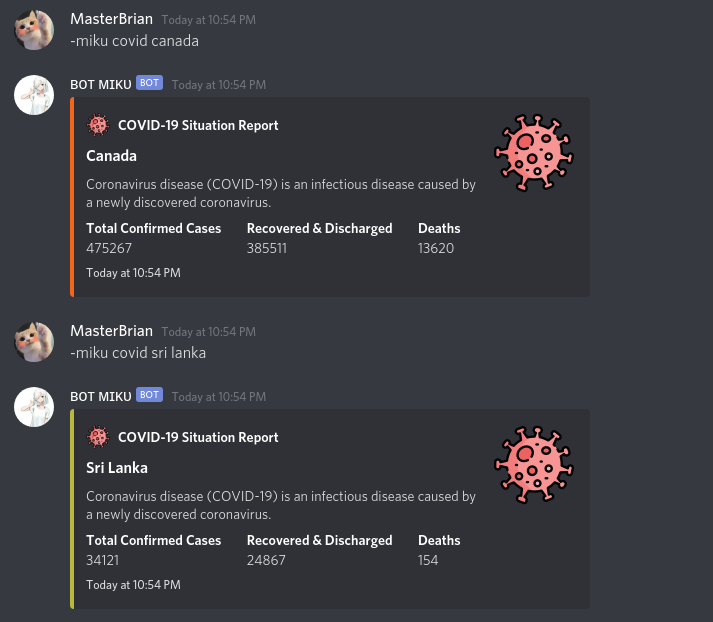

# Miku- Discord bot
### Simple Discord bot using [Discord.js](https://discord.js.org/#/) module and [Discordjs Guide](https://discordjs.guide/).

    [](https://github.com/MasterBrian99)  [](https://github.com/MasterBrian99) [](https://github.com/MasterBrian99)


<p align="center">
  
</p>

## Installation
---
### Clone this repository
```sh
   git clone https://github.com/MasterBrian99/Discord-bot-miku.git
```
### Add Discord bot token
edit `env` file as `.env` and add token in this line file
```sh
BOT_TOKEN=
```

### install require packages

```sh
   npm install
```
### start bot

```sh
   npm start
```


## Commands

| Command | Description |
| ----------- | ----------- |
| -miku gituser `username` | Get github user infomation |
| -miku gitrepo `github repository name` (MasterBrian99/Discord-bot-miku) | Get github repository information |
| -miku covid `country name` | Get github user infomation |
| -miku joke | Get a random joke |
| -miku quote  | Get a random quote |

## Built with

* #### [Discord.js](https://discord.js.org/#/) module - interact with the Discord API
* #### [Discordjs Guide](https://discordjs.guide)  -  discord.js bot guide
* #### [GitHub REST API](https://docs.github.com/) - interact with github 
* #### [Covid-19-API](https://github.com/M-Media-Group/Covid-19-API) - get information about covid  Situation 
* #### [zenquotes](https://zenquotes.io/) - random quote
* #### [one-liner-joke](https://github.com/faiyaz26/one-liner-joke) - random joke


## Exapmles
---

* ####  github user infomation

<p align="left">
  
</p>

* ### github repository infomation

<p align="left">
  
</p>

* ### realtime covid informaion

<p align="left">
  
</p>

* ### get a random joke (most of the time they are offensive btw )
<p align="left">
  
</p>

* ### get a random quote
<p align="left">
  
</p>

## Usage
**You can use any Node.js hosting platform to host this bot**

## Roadmap
#### i created  this bot to learn how to work with discord API.everything written in based on [Discordjs Guide](https://discordjs.guide). so if you are new to [Discord.js module](https://discord.js.org/#/), refer this repository.maybe it will help you.

## Special Thanks 

*  [Discord.js](https://discord.js.org/#/) 
*  [Discordjs Guide](https://discordjs.guide)
* [GitHub REST API](https://docs.github.com/)
* [Covid-19-API](https://github.com/M-Media-Group/Covid-19-API) 
* [zenquotes](https://zenquotes.io/)
* [one-liner-joke](https://github.com/faiyaz26/one-liner-joke) npm package

## Contributing
> ##### if you have anything in your mind,Make a pull request or open an issue 

## MIT License
Copyright (c) 2020 pasindu p konghawaththa

Permission is hereby granted, free of charge, to any person obtaining a copy
of this software and associated documentation files (the "Software"), to deal
in the Software without restriction, including without limitation the rights
to use, copy, modify, merge, publish, distribute, sublicense, and/or sell
copies of the Software, and to permit persons to whom the Software is
furnished to do so, subject to the following conditions:

The above copyright notice and this permission notice shall be included in all
copies or substantial portions of the Software.

THE SOFTWARE IS PROVIDED "AS IS", WITHOUT WARRANTY OF ANY KIND, EXPRESS OR
IMPLIED, INCLUDING BUT NOT LIMITED TO THE WARRANTIES OF MERCHANTABILITY,
FITNESS FOR A PARTICULAR PURPOSE AND NONINFRINGEMENT. IN NO EVENT SHALL THE
AUTHORS OR COPYRIGHT HOLDERS BE LIABLE FOR ANY CLAIM, DAMAGES OR OTHER
LIABILITY, WHETHER IN AN ACTION OF CONTRACT, TORT OR OTHERWISE, ARISING FROM,
OUT OF OR IN CONNECTION WITH THE SOFTWARE OR THE USE OR OTHER DEALINGS IN THE
SOFTWARE.
